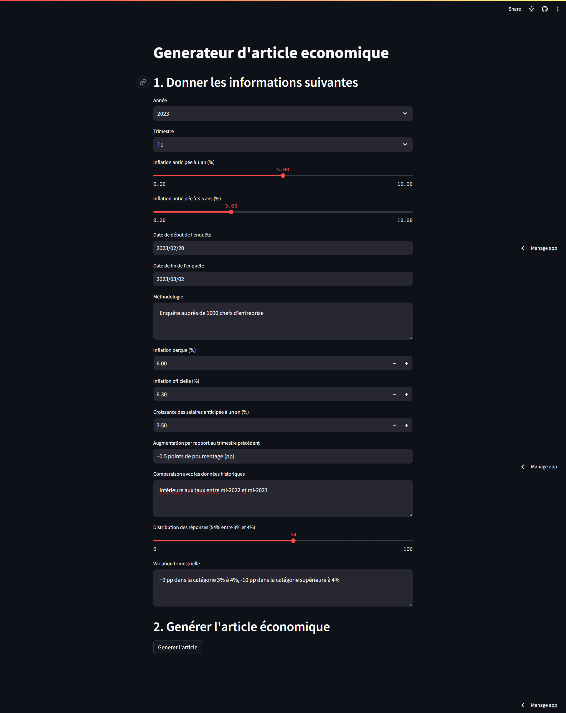
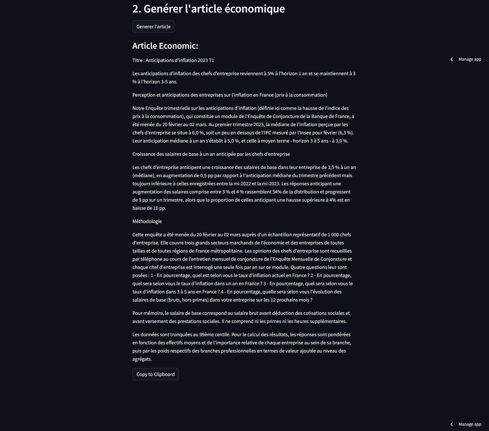

# Générateur d'article financière avec LLMs

## Introduction

Dans ce documents nous allons parler sur les différentes étapes d'implémentation d’un LLm en utilisant openai API et stremlit pour l’interface utilisateur pour créer un projet de génération des articles financière sur l’anticipation de  l’inflation.


## LLM utilisé
Le LLM utilisé est gpt-3.5-turbo pour sa rentabilité et ses capacités impressionnantes dans la gamme de prix donnée.
Les modèles locaux ont été évités en raison d'un manque de ressources de calcul disponibles. Cependant, la conception à travers LangChain permet de passer facilement à des modèles alternatifs. Le repo contient un prompt principal, conçu avec des instructions détaillées se concentrant sur un style des articles financiers. Ce prompt peut facilement être modifié.

## Etapes

1. **saisie des données initiales**
   - Il permet aux utilisateurs de saisir les informations nécessaires pour générer les l’article financier.

2. **Génération de l’article**
   - Permet de générer l’article à partir des informations initiales.


## Installation
Le projet est structuré pour utiliser un environnement virtuel, garantissant une gestion isolée des dépendances. Il nécessite également la configuration d'une clé API de openAI ChatGpt pour simuler l'accès aux services de LLM.


### Prérequis

1. Python 3.9 ou version ultérieure.
2. pip et virtualenv.

## Étapes d'installation

### Install Dependencies
1. **Clonage du dépôt:** Clonez le dépôt GitHub sur votre machine locale pour commencer.

```bash
git clone https://github.com/medbm5/financial-article-gnerator.git
cd financial-article-gnerator
```

2. **Configuration de l'environnement virtuel:**

```bash
python -m venv notes-env
# Sur Windows
notes-env\Scripts\activate
# Sur Unix ou MacOS
source notes-env/bin/activate
```

3. **Installation des dépendances:**

 ```bash
pip install -r requirements.txt
```

4. **Configuration des variables d'environnement:**

```bash
echo "OPENAI_API_KEY=<your-openai-api-key>" >> .env
```


4. **Lancement de l'application:**

```bash
run streamlit run app.py
```

## Screenshots





## Example
**Titre** : Anticipations d'inflation 2023 T1

**Les anticipations d'inflation des chefs d'entreprise reviennent à 5% à l'horizon 1 an et se maintiennent à 3 % à l'horizon 3-5 ans.**

**Perception et anticipations des entreprises sur l'inflation en France (prix à la consommation) :**

Notre Enquête trimestrielle sur les anticipations d'inflation (définie ici comme la hausse de l'indice des prix à la consommation), qui constitue un module de l'Enquête de Conjoncture de la Banque de France, a été menée du 20 février au 02 mars. Au premier trimestre 2023, la médiane de l'inflation perçue par les chefs d'entreprise se situe à 6,0 %, soit un peu en dessous de l'IPC mesuré par l'Insee pour février (6,3 %). Leur anticipation médiane à un an s'établit à 5,0 %, et celle à moyen terme - horizon 3 à 5 ans - à 3,0 %.

**Croissance des salaires de base à un an anticipée par les chefs d'entreprise :**

Les chefs d'entreprise anticipent une croissance des salaires de base dans leur entreprise de 3,5 % à un an (médiane), en augmentation de 0,5 points de pourcentage par rapport à l'anticipation médiane du trimestre précédent mais toujours inférieure à celles enregistrées entre la mi-2022 et la mi-2023. Les réponses anticipant une augmentation des salaires comprise entre 3 % et 4 % rassemblent 54% de la distribution et progressent de 9 points de pourcentage sur un trimestre, alors que la proportion de celles anticipant une hausse supérieure à 4% est en baisse de 10 points de pourcentage.

**Méthodologie:**

Cette enquête a été menée du 20 février au 02 mars auprès d'un échantillon représentatif de 1 000 chefs d'entreprise. Elle couvre trois grands secteurs marchands de l'économie et des entreprises de toutes tailles et de toutes régions de France métropolitaine. Les opinions des chefs d'entreprise sont recueillies par téléphone au cours de l'entretien mensuel de conjoncture de l'Enquête Mensuelle de Conjoncture et chaque chef d'entreprise est interrogé une seule fois par an sur ce module. Quatre questions leur sont posées : 1 - En pourcentage, quel est selon vous le taux d'inflation actuel en France ? 2 - En pourcentage, quel sera selon vous le taux d'inflation dans un an en France ? 3 - En pourcentage, quel sera selon vous le taux d'inflation dans 3 à 5 ans en France ? 4 - En pourcentage, quelle sera selon vous l'évolution des salaires de base (bruts, hors primes) dans votre entreprise sur les 12 prochains mois ?

Pour mémoire, le salaire de base correspond au salaire brut avant déduction des cotisations sociales et avant versement des prestations sociales. Il ne comprend ni les primes ni les heures supplémentaires.

Les données sont tronquées au 99ème centile. Pour le calcul des résultats, les réponses sont pondérées en fonction des effectifs moyens et de l'importance relative de chaque entreprise au sein de sa branche, puis par les poids respectifs des branches professionnelles en termes de valeur ajoutée au niveau des agrégats.

## Déploiement

L'application est déployée avec Streamlit 

## Challenge
Ce projet est developé dans le contexte du challenge de [Banque de France](https://www.banque-france.fr](https://app.b2ideas.eu/Project/DetailsProject/138)https://app.b2ideas.eu/Project/DetailsProject/138)
.
